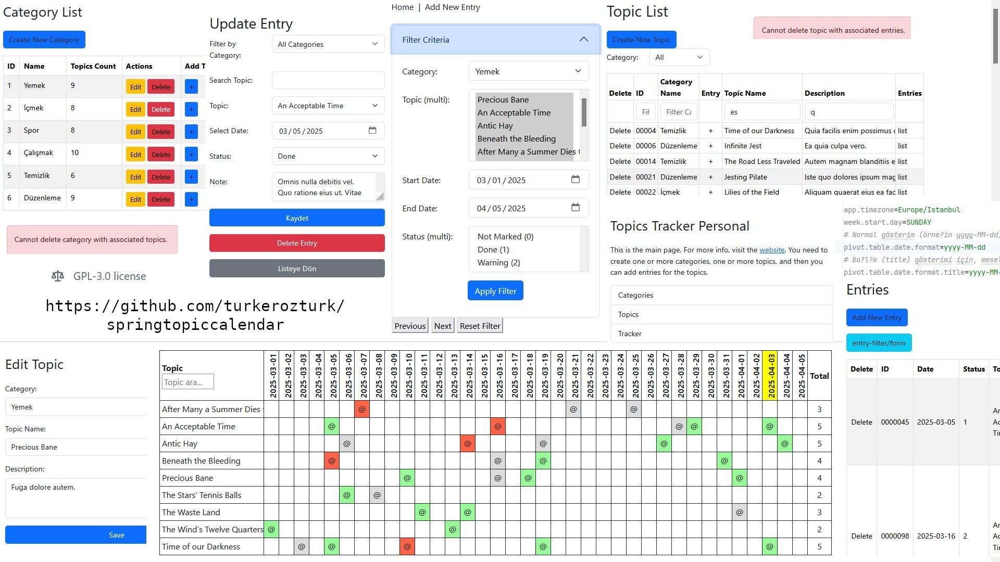
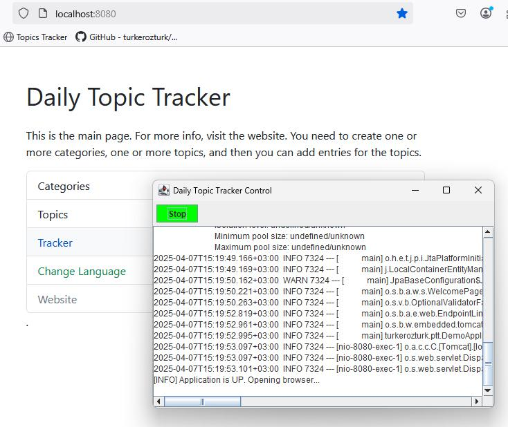

# Daily Topic Tracker
Daily Topic Tracker, a Java Spring Boot application with SQLite database.

## HOW TO DOWNLOAD

Download the daily-topic-tracker.zip archive file to your computer.
Extract its contents to an empty folder.

No installation required. It will work if Java is installed on your computer.

https://github.com/turkerozturk/springtopiccalendar/releases/download/1.0.1/daily-topic-tracker.zip

## HOW TO RUN:

Simply double click on to LaunchDTT.exe if you are using Windows OS.
And then click to the start button and wait a few seconds until it opens the application on the web browser.

Or if you want to run it manually;

Run with this console command;
java -jar daily-topic-tracker.jar

Copy and paste the link below into your web browser:
http://localhost:8080/

## HOW TO USE

You need to create one or more categories, one or more topics, and then you can add entries for the topics.

If you want to generate test data, create a file named application.properties in the same folder. Then paste the text dummy.database.create=1 into it, save it and run the application. If a database exist already, inserting test data will not work for data security.

Whether the database is empty or contains test data, it will be created in the same folder by default with the name mydatabase.db.

Website:
https://github.com/turkerozturk/springtopiccalendar

License: GPL-3.0 license

Developer: Turker Ozturk

## Screenshots

2025-04-03:

2025-04-07:

