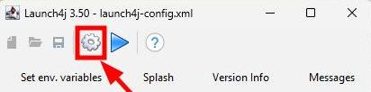

= LaunchDTT Documentation
Turker Ozturk

[TIP]
====
Jump to the "How to Compile" title if you have limited time.

Jump to the "Screenshots" title to see how it looks like.

====

==== About

Developer: Türker Öztürk

License: GPL 3.0

==== What is LaunchDTT?

It is a separate launcher app to run the main application project.

It is not necessary. But it makes the running process comfortable.

==== How it is made?
I gave the instructions to the artificial intelligence to develop it.

At first, I requested it as an AutoIT file. With a few questions it developed a working script.

Then I requested to convert it from AutoIT to Java Swing application.

[NOTE]
====
orphan/WindowsLauncher.au3 file is deprecated.
====

==== Features

* It is a GUI application.
* Can start and stop the main application.
* Can open the path of the main application by launching the file explorer of the operating system.
* Can show the console output on its GUI.
* Can start the main application with different databases, if they exist in the same folder.
** All filenames with *.db extension in the same folder will be listed on the GUI.
** If a blank file is created with *.db extension, the main application will create the database structure inside it automatically, with no data. This can be used to create a new blank database.
** If no any *.db files are exist, the datasource inside the properties file is the default db. Just click the start button on the launcher GUI. Next time it will be shown on the database selection box.

==== What Intellij IDEA says about the LaunchDTT file

Java file is located outside of the module source root, so it won't be compiled.

Therefore we need to compile it from command line.

==== Where is command line?

. Navigate to the path of the LaunchDTT.java file using the file explorer of the operating system.

. Open a new terminal window on your operating system.

==== Before Compile:

To not get "Could not find or load main class LaunchDTT" error while trying to run the jar file, make sure that there is no "package " line in the beginning of this file. If it exists, delete it.

==== How to Compile:

Type these two commands below and press ENTER;

.Commands to compile LaunchDTT.java file to LaunchDTT.java
-----
javac LaunchDTT.java
jar cfe LaunchDTT.jar LaunchDTT *.class launcher-app-icon.png

-----

Delete *.class files that start with the string "LaunchDTT", as they are no longer needed.

==== How to run the JAR file from command line

-----
java -jar LaunchDTT.jar
-----

==== How to make LaunchDTT.exe file on Windows OS

For Windows operating system, you can make EXE from JAR file using an application called Launch4j(https://launch4j.sourceforge.net/).

You need to fill the "Jar" text box with the full path of the jar file, and the "Output file" text box with the full path of exe file to be created.

Then give any filename to the XML file of Launch4j config. You can delete the config file after the operation, or store it for the next time to load.

[WARNING]
.after operation
====
You need to put the LaunchDTT.exe file into the same folder, where the compiled project JAR file is located.
====

==== Bonus - Embed JRE

To ensure that the program works, also perform the following Launch4j operation.

Create a folder named JRE in capital letters in the same folder as the application.

In the JRE tab, paste the following text into the text box named "JRE paths":

-----
JRE;%JAVA_HOME%;%PATH%
-----

-----
17
-----

Then click on to "gear icon"(Build wrapper).

We do this to avoid encountering the following two consecutive error messages and informing the user that Java is missing.

Download *zulu17.58.21-ca-jre17.0.15-win_x64.zip*
or any *JRE*(Java Runtime Environment) or *JDK*(Java Development Kit) distribution that is at least *Java version 17* from the internet, extract it and place it in the JRE folder.

https://www.azul.com/downloads/?package=jdk#zulu

The file and folder structure should look like this:

-----
tmp/
├─ JRE/         <-- Azul Zulu JRE (zulu17.58.21-ca-jre17.0.15-win_x64/)
│  ├─ bin/
│  ├─ conf/
│  ├─ legal/
│  ├─ lib/
│  ├─ DISCLAIMER
│  ├─ readme.txt
│  ├─ release
│  └─ Welcome.html
├─ application.properties
├─ daily-topic-tracker.jar
├─ LaunchDTT.exe
├─ LaunchDTT.jar
├─ readme.txt
└─ screenshot.jpg
-----
Optionally, you can put a demo database too:
-----
tmp/
├─ mydatabase.db
-----

==== How to create shortcut to LaunchDTT.exe file on the taskbar of Windows OS

Click and hold the left mouse button on the LaunchDTT.exe file, drag it on to the taskbar, release the mouse button.

==== How to create shortcut to LaunchDTT.exe file on Windows OS

Right click on the LaunchDTT.exe file to open the context menu and click "Create shortcut" menu item.

This way you can put the shortcut on  to your Windows desktop.

==== Screenshots

image::screenshot-launcher-1.jpg[]

image::screenshot-launcher-2.jpg[]

image::screenshot-launcher-3.jpg[]

If more than one *.db files are exist in the same folder, it will show a selection box to select a database at startup.

Once the start button is clicked, the selection box will be disabled until the stop button is clicked.

Example: Uncomment and change the default server port in the application.properties file.

In which case do you get the error message and how to solve it?

When the Launcher is run, it reads the server port value from the application.properties file and checks whether that port number is free in the operating system.

If it is not idle, the application will give you written information about what to do, as in the screenshot below.

It may also give the same error as in the screenshot below. The difference is that the port is idle when the Launcher starts, then another application that occupies that port is started and then you press the start button. The steps to be taken are as explained in the previous screenshot.

Asking for user confirmation when closing the application window.

