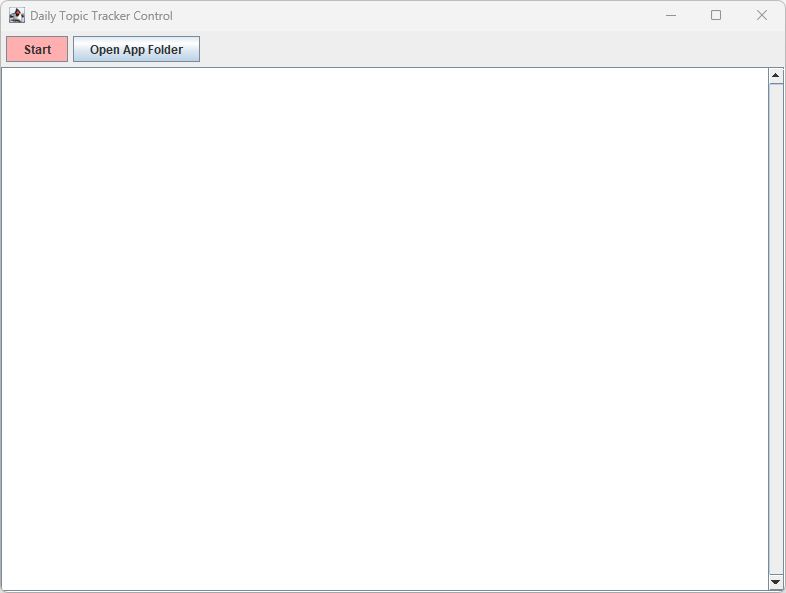
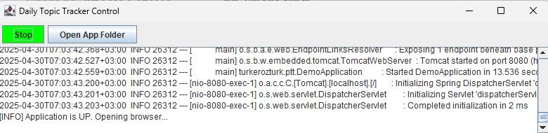

= LaunchDTT Documentation
Turker Ozturk

[TIP]
====
Jump to the "How to Compile" title if you have limited time.

Jump to the "Screenshots" title to see how it looks like.

====

==== About

Developer: Türker Öztürk

License: GPL 3.0

==== What is LaunchDTT?

It is a separate launcher app to run the main application project.

It is not necessary. But it makes the running process comfortable.

==== How it is made?
I gave the instructions to the artificial intelligence to develop it.

At first, I requested it as an AutoIT file. With a few questions it developed a working script.

Then I requested to convert it from AutoIT to Java Swing application.

[NOTE]
====
orphan/WindowsLauncher.au3 file is deprecated.
====

==== Features

* It is a GUI application.
* Can start and stop the main application.
* Can open the path of the main application by launching the file explorer of the operating system.
* Can show the console output on its GUI.

==== What Intellij IDEA says about the LaunchDTT file

Java file is located outside of the module source root, so it won't be compiled.

Therefore we need to compile it from command line.

==== Where is command line?

. Navigate to the path of the LaunchDTT.java file using the file explorer of the operating system.

. Open a new terminal window on your operating system.

==== How to Compile:

Type these two commands below and press ENTER;

.Commands to compile LaunchDTT.java file to LaunchDTT.java
-----
javac LaunchDTT.java
jar cfe LaunchDTT.jar LaunchDTT *.class
-----

==== How to run the JAR file from command line

-----
java -jar LaunchDTT.jar
-----

==== How to make LaunchDTT.exe file on Windows OS

For Windows operating system, you can make EXE from JAR file using an application called Launch4j(https://launch4j.sourceforge.net/).

You need to fill the "Jar" text box with the full path of the jar file, and the "Output file" text box with the full path of exe file to be created.

Then click on to "gear icon"(Build wrapper).

Then give any filename to the XML file of LAunch4j config. You can delete the config file after the operation, or store it for the next time to load.

[WARNING]
.after operation
====
You need to put the LaunchDTT.exe file into the same folder, where the compiled project JAR file is located.
====

==== How to create shortcut to LaunchDTT.exe file on the taskbar of Windows OS

Click and hold the left mouse button on the LaunchDTT.exe file, drag it on to the taskbar, release the mouse button.

==== How to create shortcut to LaunchDTT.exe file on Windows OS

Right click on the LaunchDTT.exe file to open the context menu and click "Create shortcut" menu item.

This way you can put the shortcut on  to your Windows desktop.

==== Screenshots

